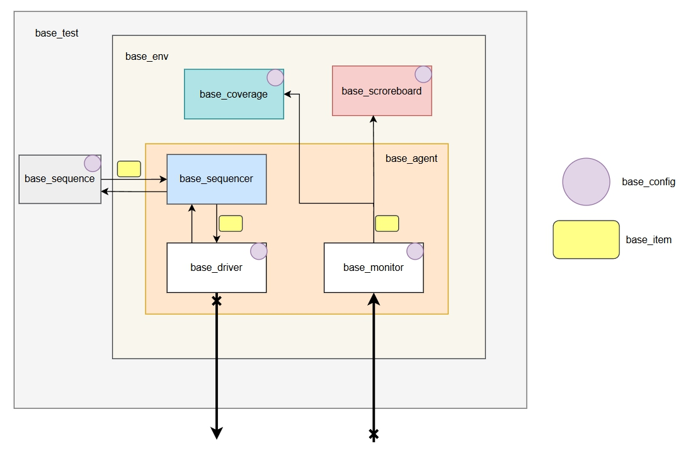

# Верификация сетей на кристалле

Верификация сети на кристалле включает в себя 3 этапа:
- Автономная верификация маршрутизатора
- Автономная верификация межсоединений (interconnect)
- Системная верификация сети в целом

### Проблема
Существующие верификационные решения жестко привязаны к конкретным реализациям: фиксированная топология, фиксированный интерфейс, фиксированный протокол. Это приводит к дублированию кода и усложняет повторное использование при смене конфигурации сети.

### Цель проекта  
Разработать базовые параметризованные UVM-окружения для верификации сетей на кристалле, которые легко адаптируются к различным топологиям, интерфейсам и протоколам без модификации ядра окружения.

### Решение
[Базовое окружение маршрутизатора](./base_tb/base_router_tb/)  
[Базовое окружение сети](./base_tb/base_noc_tb/)    

[Описание решения](./base_tb/)  

Схема реализованных окружений:

### Практическое применение
В качестве примера использования базовых окружений выполнена верификация сети, сгенерированной программой HDLNocGen: [Реализация](./old_tb/)

