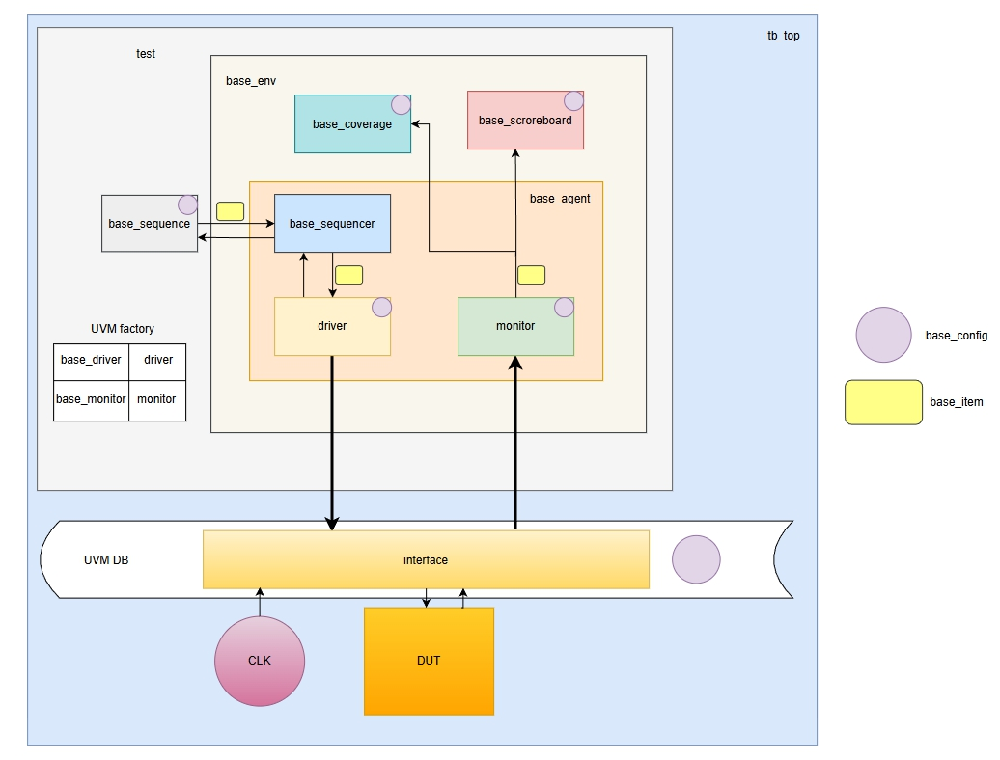

# Верификация сетей на кристалле для HDLNoCGEN

Базовые окружения base_noc_tb и base_router_tb адаптированы под конкретную реализацию сети, сгенерированной программой HDLNoCGEN  
### Требования
Для запуска тестов необходим ModelSim/QuestaSim с поддержкой UVM  
### Порядок запуска 
`make -C program/Makefile`  
`bin\generator.exe <rtl_path> <topology> <PL> <CS> <REN> <X> <Y> <RN>`  
  
После успешной генерации Makefile:  
`make help` - для получения справки  
### Возможности окружения
Запуск тестов маршрутизатора и сети, симуляция c логированием, проверка функциональности, сбор функционального и кодового покрытия, с генерацией txt и html отчета, просмотр waveform
### Описание генерируемых сетей
Генератор HDLNoCGen поддерживает три топологии:
- Mesh
- Torus
- Circulant

Настраиваемые параметры:
- Длина и структура буфера
- Алгоритм и порядок маршрутизации
- Тип арбитража

На основе топологии и параметров формируется SystemVerilog-описание сети и маршрутизаторов.

- `PL` - общая длина передаваемого пакета
- `CS` - кол-во бит для кодирования размера сети 
- `REN` - кол-во портов маршрутизатора
- `X`,`Y` - размерность сети для mesh/torus, для circulant Y=N (кол-во узлов=`RN`), X=S (сдвиг)
- `RN` - число маршрутизаторов сети

---
Структура пакета: 

`packet[0]` - валидность передаваемого пакета

для mesh/torus:  
    `packet[1:CS]` - X координата адреса  
    `packet[CS+1:2*CS]` - Y координата адреса  
    `packet[2*CS+1:PL-1]` - передаваемые данные  
  
для circulant:  
    `packet[1:CS]` - адрес  
    `packet[CS+1:PL-1]` - передаваемые данные

Все варианты реализуются в одном окружении с помощью условной компиляции (макросы `MESH_TORUS` или `CIRCULANT`)

### Адаптация базовых окружений

[Маршрутизатор](./old_router_tb/)  
[Сеть](./old_noc_tb/)

#### Интерфейс
Взаимодействие DUT с окружением реализовано через:
- [router_interface](./old_router_tb/lib/old_router_if.sv) - для маршрутизатора
- [noc_interface](./old_noc_tb/lib/old_noc_if.sv) - для сети

#### Драйвер
Реализован драйвер, маппирующий сигналы `base_router_item`/`base_noc_item` на интерфейс. Для mesh/torus добавлены функции преобразования поля destination в координаты X,Y

#### Монитор
Реализован монитор, выполняющий обратное преобразование: сигналы интерфейса на `base_router_item`/`base_noc_item`. Для mesh/torus написаны функции восстановления destination из координат X,Y

#### Топ-уровень
Создание `base_router_config`/`base_noc_config`, парсинг параметров теста из командной строки, добавление объекта конфигурации в UVM БД, инстанцирование DUT и его интерфейса, добавление интерфейса в UVM БД

#### Тесты
Созданы наследники базовых тестов с указанием конкретных параметров: разрядность данных, количество портов маршрутизатора, количество маршрутизаторов в сети. C помощью UVM-фабрики выполнено переопределение базовых драйверов и мониторов в build-фазе

#### Схема окружений

